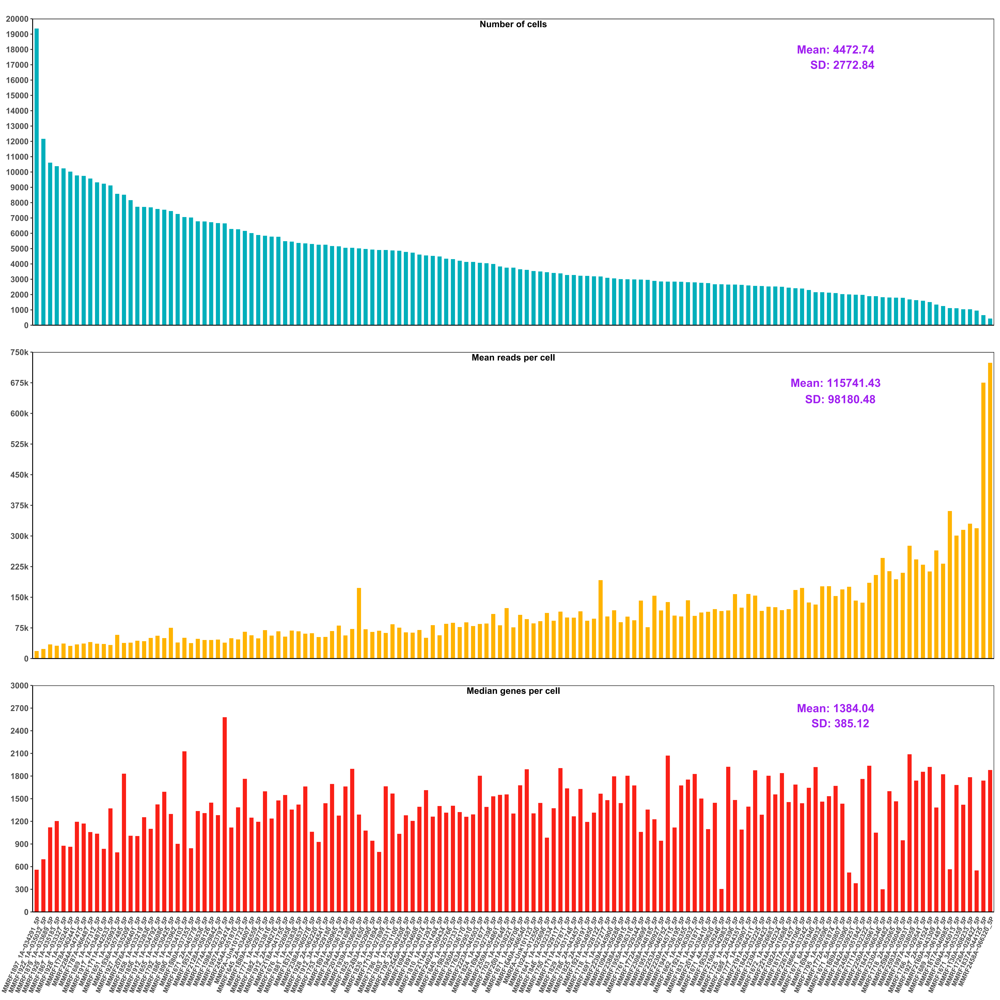
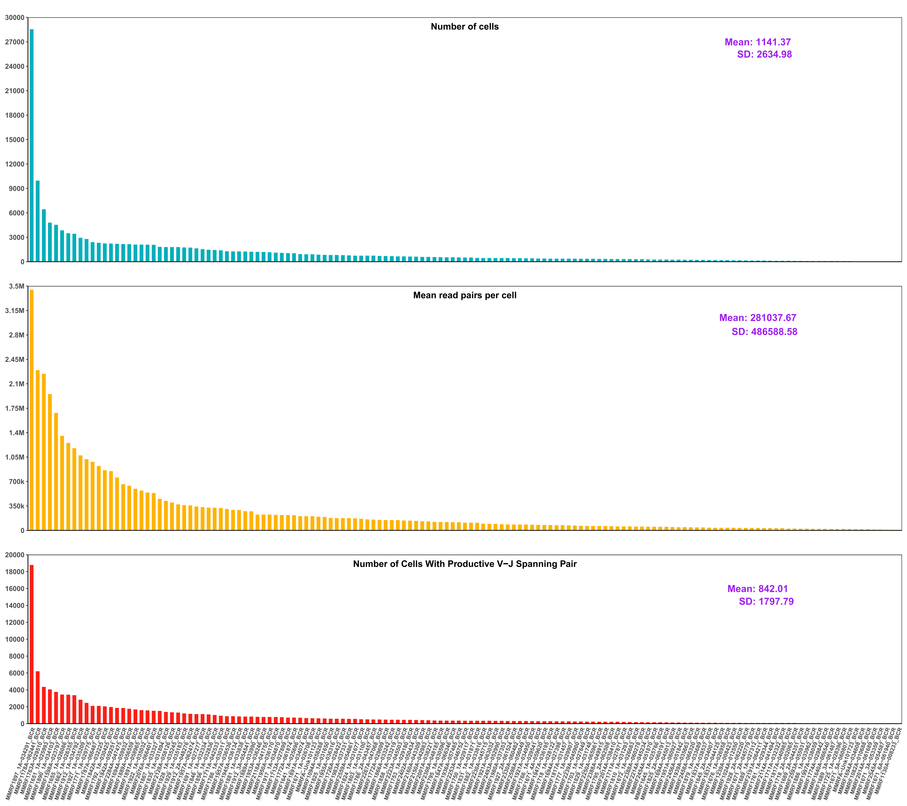
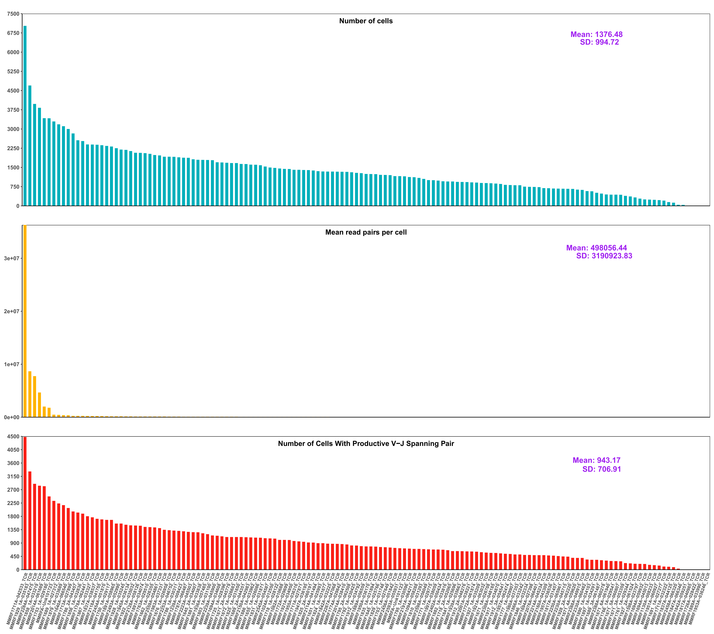

# 🧬 MMRF Single-Cell Pipeline

## 🔬 Overview

This repository provides a pipeline for analyzing MMRF single-cell sequencing data. The workflow begins with raw FASTQ files and proceeds through a series of preprocessing steps to generate aligned BAM files and downstream visualizations.

The code is organized into three main modules:

- `01pre_folder/`: Generates a data tracking table for managing metadata and file paths.
- `02process/`: Processes 5' gene expression, BCR, and TCR libraries.
- `03analysis/`: Produces QC bar plots to visualize the number of cells, genes, and reads across samples.

Each folder is numbered to reflect the recommended execution order.

---

## 🚀 Usage

To run the QC summary script, use the following command:

```bash
Rscript qc_summary.R -o /your/output/dir -c /your/cellranger/path
```

- `-o`: Output directory where QC result files will be saved.
- `-c`: Path to the folder containing Cellranger output directories (e.g., `5P`, `BCR`, `TCR`).

---

## 🧪 QC Summary Plots

### 📊 Cell Numbers Across Assays

This plot summarizes the estimated number of cells detected in each sample across the 5P, BCR, and TCR assays.


---

### 🧬 QC of 5P Data

The following plot displays quality metrics for the 5P (5' gene expression) assay, including estimated cell counts, mean reads per cell, and median genes per cell.



---

### 🔬 QC of BCR Data

This figure presents QC metrics for B-cell receptor (BCR) libraries, such as estimated cell counts, mean read pairs per cell, and the number of cells with productive V-J spanning pairs.



---

### 🧫 QC of TCR Data

This plot illustrates QC results for T-cell receptor (TCR) libraries, highlighting read depth, cell number, and detection of productive V-J pairs.



---

## 📁 Repository Structure

```
.
├── 01pre_folder/      # Metadata and path tracking
├── 02process/         # Processing of 5P, BCR, TCR data
├── 03analysis/        # QC visualization scripts
├── images/            # Output plots for QC summary
└── README.md          # Project documentation
```

---

## 📌 Notes

- The script expects `metrics_summary.csv` files from Cellranger outputs inside each assay folder.
- Ensure the sample folder names follow consistent naming conventions.
- The script requires the `optparse` and `stringr` packages.
